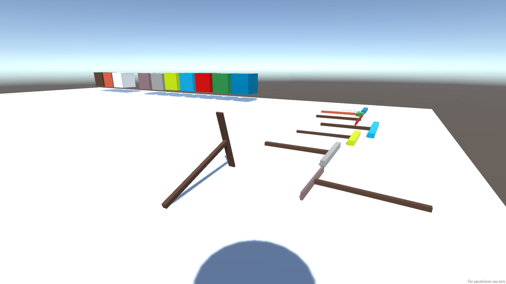

### Summary:

This is an unamed work-in-progress crafting game.

In the current demo, you can pickup pickaxes with different stats that can be use to chop wood and mine minerals. To craft armor and tools go to the crafting bench and selet a mineral you want to craft with. You can also check your inventory to see your current stats and the amount of materials your holding.

### Getting and Opening the demo:

To get the project and use it, go to the releases tab, click on __CraftingDemo.zip__ to start downloading the project.

You can go to your computers files, and from there go to downloads and right click on __CraftingDemo.zip__ then click extract all.

Once that is done, go to where you stored the file, then open __CraftingDemo__, then double click __Crafting-Game.exe__ to run the program.

### Controls:

To Look around just Move the mouse in the direction you want to look.
Use the following controls to interact with the scene:

    W: Press to move forward
    A: Press to move left
    S: Press to move backwards
    D: Press to move right
    I: Press to open the inventory screen, press again to close the screen
    Escape: Exits Demo
    Right Mouse Button: Interact with crafting UI, tools, materials, and the crafting bench.
